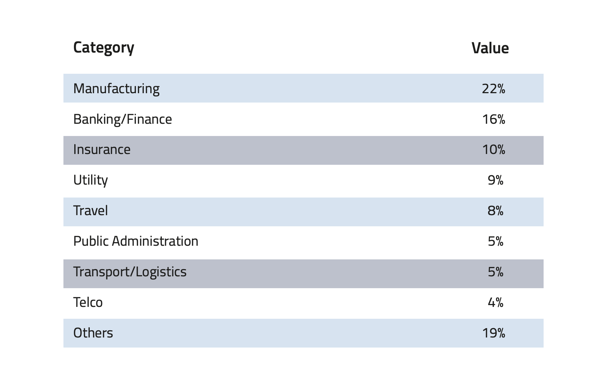

Context: Italy’s competitive position and challenges ahead
==================================================================

The Italian Ecosystem
---------------------

The Italian AI ecosystem is composed of four categories of actors: 
1) research communities 
2) knowledge-transfercentres 
3) technology and solution providers, and 4) private and public user organisations. 
This section reviews each category’s relative strengths and weaknesses.

A. **Research Communities**

Italy has a vibrant AI research community, which contributes to the Italian AI ecosystem in four ways:

-  **Research**: Italian researchers are active in both fundamental and applied research, thus covering all fields of AI. In particular, Italian research is clustered around the following topics: Machine/Deep Learning, Computer Vision,  Natural Language Processing (NLP), Data Mining, Big Data analytics, Embedded AI, Human aspects in AI, Knowledge Representation and Symbolic Learning, Decision Support Systems, Agent-based systems and Trustworthy AI. Research in AI is mainly carried out in research labs of universities and public research centres as in the National Research Council (CNR) - and in research foundations such as Fondazione Bruno Kessler and the Italian Institute of Technology. As we shall see later, this community has a widely recognized international standing in terms of quality and quantity of its research output.

-  **Education and training**: Italian universities offer more than **200 AI curricula** spread over roughly 50 universities. To further boost this ecosystem, Italy launched in 2021 the **National “Artificial Intelligence” PhD Programme (PhD-AI.it)**, one of the largest and most ambitious PhD programmes in artificial intelligence worldwide. The programme involves over 50 universities, three public research bodies and three research organisations with a view to train researchers, innovators and professionals. The PhD-AI.it is composed of five federated PhD courses, which share a common core curriculum in AI foundations and developments. Each course has an area of specialisation related to a strategic sector for AI application: health and life sciences, agrifood and environment, security and cybersec, industry 4.0, and society. To date, the programme has issued 200 PhD scholarships with a budget of €16 million [1]_ .

-  **Assets**: the Italian ecosystem hosts several top-tier **research infrastructures**, in terms of computational power and data lakes. Examples are the CINECA-INFN Infrastructure for HPC, CNR -High Performance Artificial Intelligence Center HP-AI, the IIT HPC infrastructures devoted to the new 2020-2023 Strategic asset in AI and Machine Learning. These are all capable of providing computing facilities and AI competences that allow scientists of any discipline to realise complex and computationally demanding AI experiments.

-  **Communities**: Italian researchers participate in all major **AI international research networks**, including the top rated EU networks, such as CLAIRE [2]_ , ELLIS - confederating several AI laboratories all over Europe [3]_ - and the networks of excellence under the EU Horizon 2020 ICT-48 portfolio, namely HumanE-AI-Net, TAILOR, AI4MEDIA, ELISE and VISION. Italy is one of the founding members of **Global Partnership on AI (GPAI)** as the result of an idea developed within the G7, under the Canadian and French presidencies. This partnership aims to bridge the gap between theory and practice in AI. Italy has also a remarkable tradition of national scientific **research associations**, such as AIxIA, CVPL and AILC. In particular, AIxIA is the Italian Association of Artificial Intelligence, founded in 1988, and a member association of EurAI, the European Association of Artificial Intelligence. Many Italian researchers have covered important roles in the EurAI board. CVPL is the association of Computer Vision, Pattern Recognition and Machine Learning founded in 1983, devoted to theory and application of AI for multimedia data, connected with the International Association of Pattern Recognition. AILC is the Italian Association of Computational Linguistics, mainly devoted to research in natural language processing.

At the same time, however, the Italian AI research ecosystem presents **four main weaknesses** this strategy will
address, and namely: 

-  **Parceled growth of research labs**. Despite the international excellence of the Italian AI research community, the persistent issue of scale, critical mass and interdisciplinary integration of research labs, together with the scarce public/private national funding of fundamental research, represent a serious potential risk for the country’s competitiveness.

-  **Poor talent attraction**. While new talents’ development is adequate in Italy, talent attraction is poor, with few foreign talents coming to work in Italy. No special strategies have been effective, until now, to support the attraction of foreign talents.

-  **Significant gender gap**. A survey of 2020 of CINILab AIIS National Assembly among its members shows that only 19.6% of AI researchers are women, compared to close to 50% in STEMS overall. [4]_.

-  **Limited patent capacity**. Italy yields far less patents per paper than EU peers.

B. **Knowledge transfer centres**

Alongside universities and research nodes, Italy has a wide network of **knowledge transfer centers**, promoted by
industrial associations and institutions at the national and local level. Among these, it is worth mentioning 20+
Digital Innovation Hubs (DIHs) promoted by Confindustria [5]_ , 70+ Punti Impresa Digitale promoted by Italian Chambers
of Commerce [6]_ and 8 competence centres [7]_ promoted by the Ministry of Economic Development. These centres, which
belong to the Network Industria 4.0, offer services ranging from sensibilization and awareness campaigns, to technology 
assessment, strategic roadmapping and employee training. In addition to these national resources, Italy is
active in the EU-DIHs network [8]_, which will function as one-stop shops that help companies dynamically respond to
the digital challenges and become more competitive.

C. **Technology and solution providers**

The Italian ecosystem is characterised by a variety of technology providers which specialise in a variety of AI solutions. 
As of February 2021, the Observatory on AI [9]_ registered 260 Italian companies offering AI products and services (See Figure 1): 

-  The majority of them (55%) offer solutions designed to be used in specific areas, i.e. **Healthcare, Marketing & Sales, Finance and Cybersecurity**. 

-  One quarter (25%) are more general in nature, providing for example advanced analysis of structured and unstructured data for purposes that may concern Forecasting, Classification, Natural Language Processing, Computer Vision, Human-AI interaction in various application areas. About a third of these companies are start-ups [10]_ .

-  The remaining companies are divided between System integrators (about 10%) and Consulting companies (about 5%), most of which are either medium or large companies.

-  Few of them are cloud providers offering AI solutions and companies offering sensing and edge computing for efficient computing or storage dedicated to AI. Cloud providers are limited in number but they tend to be among the largest players. The largest among them offer services in critical infrastructures management or cybersecurity. 

**Figure 1:**\ *Italian companies offering AI products, by sector*

.. image:: ./media/image7.jpg

In addition, several large corporations are creating in-house AI research labs to create solutions and products that
may cater to their business, their clients or both. Companies are most active in the energy, security, aerospace,
telecommunications, insurance, banking, cloud and household and personal care (HPC) sectors.

Lastly, the Italian entrepreneurial ecosystem registers a growing number of start-ups with AI expertise; CINI Lab AIIS
in 2020 surveyed 110 university spin-offs or start-ups connected with research centres, focusing on machine or
deep learning, big data analytics and human-AI interaction. This figure is particularly relevant as AI is one of the
sectors where startups concentrate the most, showing a national proclivity for the sector.

Despite the considerable number of players / start-ups, **the AI market in Italy is still very limited in size** and this is
negatively affecting the growth of our companies and their investment capability. Considering the fast development 
rate of AI, this represents a weakness that should be addressed.

D. **Private and public user organisations**

Lastly, the Italian ecosystem is composed of private and public users organisations. As for private organisations, in
2020 according to a research conducted by the School of Management of Politecnico di Milano, 53% of medium-large
Italian companies declare that they have started at least one AI project. The sectors that show the greatest diffusion
of fully operational projects are manufacturing (22% of total projects started), banking-finance (16%) and insurance
(10%). 

**Table 2:**\ *AI projects within Italian medium-large companies, by sector*

In 2020, the Artificial Intelligence private market in Italy reached a value of €300 million, an increase of 15% over
2019 but that still places Italy’s contribution to Europe’s AI market below its GDP contribution (ca. 3% vs. ca. 12%).
Within the Italian market, €230 million (77%) was commissioned by Italian companies, while €70 million (23%) was
project exports. The Politecnico study highlights the following classes of AI based solutions: 

-  *Intelligence Data Processing* (33% of the expenditure),

-  *Natural Language Processing* (18%),

-  *Recommendation Systems* (18%),

-  *Intelligent RPA, Chatbot / Virtual Assistant and Computer Vision* (31%).

With regards to the public sector, understanding what is happening in the field of digital transformation is crucial in
order to imagine how AI can create synergies with the process of digitising the country. According to the study E-government Benchmark 2020 by the European Commission, [13]_, Italy is characterised by a low level of penetration (25% vs.
60% of EU27+UK) and a medium level of digitisation (71% vs. 72% EU 27+UK). Therefore, there is still a gap between
the supply of digital services and their actual use. Although the digitisation level is in line with the performance of
other European countries with similar environments, online services are not fully widespread all over the country. 

Italy’s international position
----------------------------------------------------

The Italian AI ecosystem is in line with international peers [14]_ when it comes to research quality and output. Yet, this
ecosystem fares less well when it comes to business spending on R&D, patenting and AI applications. Table 3 summarises key statistics. 

**Table 3:**\  *Comparison and international position*

.. list-table:: 
   :widths: 50 25 25 25 25 25
   :header-rows: 1

   * - 
     - |image4|
     - |image5|
     - |image6|
     - |image7|
     - 
   * - **National R&D resources**
     -
     -
     -
     -
     - `Learn more <https://ec.europa.eu/eurostat/web/products-eurostat-news/-/DDN-20201127-1>`_
   * - R&D expenses (as a % of GPD, 2019)
     - 3,17% 
     - 2,19%
     - 1,76% 
     - 1,45%
     -
   * - Share of GDP in Research [15]_ (as a % of GPD, 2019)
     - 0,46%  
     - 0,28% 
     - 0,13%  
     - 0,20% 
     -
   * - R&S (€Mln, 2019)
     - 109.544 €
     - 53.158 € 
     - 44.364 € 
     - 25.910 € 
     - `Learn more <https://ec.europa.eu/eurostat/web/products-eurostat-news/-/DDN-20201127-1>`_
   * - R&D personell per millions inhabitants (2018)
     - 8.500
     - 6.950
     - 7.000
     - 5.150
     - `Learn more <http://data.uis.unesco.org/Index.aspx?DataSetCode=SCN_DS&lang=en>`_
   * - **AI research and patents statistics**
     - 
     - 
     -
     - 
     - 
   * - AI pubblications (2019)
     - 2.660 
     - 2.755
     - 2.974
     - 739
     - `Learn more <https://jfgagne.ai/global-ai-talent-report-2020/>`_
   * - AI pubblications (2019)
     - 5.310
     - 3.352
     - 6.645 
     - 3.374 
     - `Learn more <https://www.oecd.ai/data-from-partners?selectedTab=AIResearch>`_
   * - Average AI researchers productivity [16]_ 
     - 2,00
     - 1,22
     - 2,23
     - 4,57
     - 
   * - Patenting strategy intensity index (%global patents / %global publications)
     - 0,79
     - 0,34
     - 0,29
     - 0,07
     - 
   * - Patents Equivalent patent applications 2019
     - 178.184
     - 67.294
     - 54.762
     - 32.001
     - `Learn more <https://www.wipo.int/edocs/pubdocs/en/wipo_pub_941_2020.pdf>`_
   * - Number of agents [17]_
     - 147
     - 76
     - 163
     - 42
     - `Learn more <https://data.jrc.ec.europa.eu/dataset/0cb8ba74-097c-4197-ac50-cfbb0a5099a5>`_
   * - **Business investments and outcomes on AI**
     - 
     - 
     - 
     - 
     - 
   * - Business spending on R&D (€Mln, 2018)
     - 74.162 €
     - 33.809 €
     - 28.926 €
     - 14.691 €
     - `Learn more <http://data.uis.unesco.org/Index.aspx?DataSetCode=SCN_DS&lang=en>`_
   * - R&D business spending on R&D  (% of the PIL, 2018) [18]_
     - 2,23%
     - 1,45%
     - 1,22%
     - 0,84%
     - `Learn more <http://data.uis.unesco.org/Index.aspx?DataSetCode=SCN_DS&lang=en>`_
   * - Number of Global Digital Champions [19]_
     - 8
     - 7
     - 33
     - 0
     - 
   * - 
     - 
     - 
     - 
     - 
     - 
   * - Government AI-dedicated declared investments (€ Mld)
     - 5,0 €
     - 3,0 €
     - n.a.
     - Output plan
     - `Learn more <https://publication.enseignementsup-recherche.gouv.fr/eesr/FR/T923/l_e!ort_de_recherche_et_developpement_en_france/>`_

**Research position**

Italian AI researchers have a widely recognized international standing regarding scientific output, both in terms of
quantity and quality [20]_.

Nevertheless, there are several limitations affecting the Italian research landscape - both in the public and private
sphere - which need to be explicitly considered and addressed. In particular: 

-  The **public research system is less funded than peers and wages are low**. On average, EU countries (EU28) [21]_ invest 2.38% of GDP in research, while Italy invests 1.45% of GDP only. Low funding is compounded by low wages, as public research institutions must comply with the same rules as the rest of the Public Administration, without considering the specific needs of these entities. As a consequence, Italian researchers receive lower wages (€15,343 for PhDs) than in Germany (€48,027), France (€20,220), UK (€17,272 tax-free) and Switzerland (€67,998). [22]_

-  In the private sector, firms are underinvesting in R&D. Although Italian companies spend €14.7 billion in R&D per annum (2018) this figure is less than average EU peers. Investments are also constrained by the small size of the average Italian firm. Lastly, Italy is missing **global Digital Champions** [23]_ in the hardware, software and integration areas, and is thus missing a key factor in stimulating innovation.

**Technology & solution providers**

The Italian Market for AI solutions is still small, as Italian companies are lagging in the digital transformation process.
The adoption rate of AI solutions by Italian corporates is lower (35%) than the EU average (43%) and in 2017 only 15%
had projects beyond the pilot phase (vs. 32% for European peers) [24]_. Italian corporations indicate the high costs of 
adoption and the absence of public funding as the main obstacle. Moreover, Italian companies struggle to find qualified AI
professional [25]_. Since AI is a significant enabler of productivity growth, this late adoption will negatively impact GDP growth, widening
the gap between Italy and peer countries. According to McKinsey [26]_, while AI-driven GDP will grow at 19% for the EU ,
it will grow only by 13% in Italy.

**Summary: Challenges ahead**

The evidence provided so far calls for a radical upgrade and update of Italy’s national AI strategy. As described, the
country needs to enhance the positive elements of its current ecosystem while concentrating on reforming and investing in specific areas of weakness. In short, Italy needs to:

-  Strengthen its AI research base and funding,
  
-  Foster measures to retain and attract talent,

-  Improve its technology transfer process,\ |image8|

-  Increase AI adoption among firms and public administration as well as foster the creation of innovative enter- prises.

The remainder of this document will provide the details of Italy’s plan going forward.

.. raw:: html

   

.. [1]
The first two cycles of PhD-AI.it have been co-funded with about €8 million by the Ministry of University and Research and with the same amount 
by the universities and research organizations participating in the programme.

.. [2]
   `Claire - AI <https://claire-ai.org/>`__

.. [3]
   `ELLIS units <https://ellis.eu/units#pro%1Fle>`__\ \ \, three of them in Italy in Genova, Torino and Modena 

.. [4]
   `Survey from CINI <https://www.ansa.it/canale_lifestyle/notizie/societa_diritti/2021/07/24/donne-e-ricerca-scientifica-litalia-avanti-verso-la-parita-di-genere_7bc6393e-d37f-46ae-b4f4-c87362aee7b6.html>`__\ \ \ `-.` - Lab AIIS National Assembly 2020: 229 women and 936 men among a total 1167 members; for overall 
   STEM figures, see Elsevier Foundation 2021 Report: Gender in Research cited in Ansa on July 24th 2021.

.. [5]
   Confindustria, `\ \ \ Digital Innovation
   Hubs <https://www.puntoimpresadigitale.camcom.it/>`__\ \ \ `.`

.. [6]
   Italian Chamber of Commerce, `\ \ \ Punto Impresa
   Digitale <https://www.puntoimpresadigitale.camcom.it/>`__\ \ \ `.`

.. [7]
   Centri di competenza ad alta
   specializzazione, `\ \ \ MISE <https://www.mise.gov.it/index.php/it/incentivi/impresa/centri-di-competenza>`__\ \ \ `.`

.. [8]
   European Commission, `\ \ \ European Digital Innovation
   Hubs <https://digital-strategy.ec.europa.eu/en/activities/edihs>`__\ \ \ `.`

.. [9]
   Politecnico di Milano, `\ \ \ Osservatorio italiano
   sull'IA <https://www.osservatori.net/it/home>`__\ \ \ `.`

.. [10]
   Registered in the innovative startups section of the Business Register of the Chamber of Commerce.

.. [11]
   Italian Observatory on AI, 2021, Il Mercato 2020 dell’Artificial Intelligence in Italia: Applicazioni e Trend di Sviluppo.

.. [12]
   European AI spending data from Statista; GDP figures from IMF WEO.

.. [13]
   European Commission, `\ \ \ EGovernment Benchmark
   2020 <https://op.europa.eu/en/publication-detail/-/publication/8e708e4f-f98c-11ea-b44f-01aa75ed71a1/language-en/format-PDF/source-233013088>`__\ \ \ `.`

.. [14]
   Comparison with peers has been focused on Germany, France and UK; these countries are similar to Italy in 
   terms of size (population), scholarization, GDP and relative weight of the different sectors on GDP.

.. [15]
   Calculated based on data from Eurostat 2020, "R&D expenditure in the EU at 2.19% of GDP in 2019".

.. [16]
   Calculated based on the 2 lines above.

.. [17]
   Companies, Research Inst., Universities, ... involved in AI patents (from 2009 to 2018).

.. [18]
   Calculated based on data from UNESCO UIS, Eurostat 2020, "R&D expenditure in the EU at 2.19% of GDP in 2019", and IMF: WEO October 2020.

.. [19]
   AI unicorn companies count on Dealroom.com.

.. [20]
   See for instance Best Paper Award @NeurIPS (Dec, 2020) or also CNR results on AI applied to quantum computing, (Aug 2021).

.. [21]
   High-level working group of the Italian National Commission for 
   UNESCO, 2021, Ricerca e sviluppo: quale futuro per l’Italia?

.. [22]
   Data retrieved from `Informatics Europe <https://www.informatics-europe.org/data/higher-education/academic-salaries/phds-postdocs.html>`__\ \ \ `.`

.. [23]
   Companies which are providing digital services to other companies all around the world, to run their business.

.. [24]
   Eurostat, 2020, “European enterprise survey on the use of technologies based on 
   artificial intelligence”; with some stats from POLIMI Osservatorio for the interviewed 
   companies observed a 50% of adoption; American Chamber in Italy report.

.. [25]
   More than 50% of interviewed companies declared that the one of the major 
   obstacles is the absence of AI professionals (Osservatorio AI del Politecnico di Milano/2020).

.. [26]
   Data presented by McKinsey during the event `“The Future Is Now” <https://www.mckinsey.com/~/media/McKinsey/Featured%20Insights/Artificial%20Intelligence/Notes%20from%20the%20frontier%20Modeling%20the%20impact%20of%20AI%20on%20the%20world%20economy/MGI-Notes-from-the-AI-frontier-Modeling-the-impact-of-AI-on-the-world-economy-September-2018.ashx>`__\ \ \ held in Milan in 2019.

.. |image0| image:: ./media/image2.png
   :width: 0.35069in
   :height: 0.37132in
.. |image1| image:: ./media/image3.png
   :width: 0.51913in
   :height: 0.4184in

.. |image3| image:: ./media/image5.png
   :width: 0.50056in
   :height: 0.44965in
.. |image4| image:: ./media/image2.png
   :width: 0.35069in
   :height: 0.37132in
.. |image5| image:: ./media/image3.png
   :width: 0.51913in
   :height: 0.4184in

.. |image7| image:: ./media/image5.png
   :width: 0.50056in
   :height: 0.44965in
.. |image8| image:: ./media/image6.png
