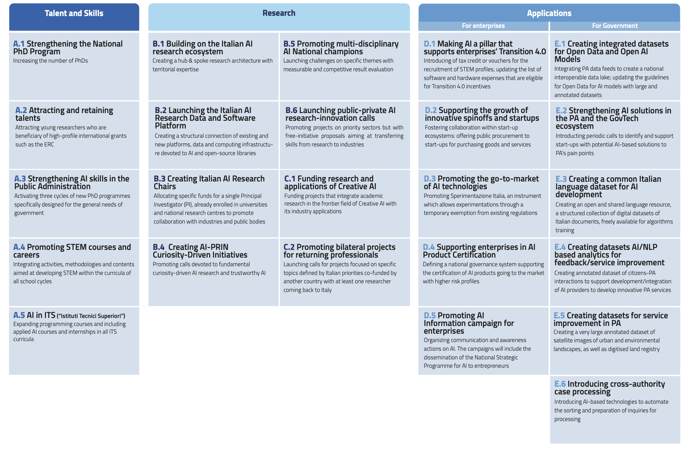

Executive Summary
=================

Today, **Artificial Intelligence (AI)** - digital models, algorithms and 
technologies for sophisticated perception, reasoning, interaction 
and learning - has matured to the point that it **represents a central factor in the digital 
transformation of society**. 
Going forward, AI is predicted to be integrated in and affect the majority 
of economic activities, by **providing opportunities for higher 
productivity, automation and more advanced analytics across sectors**.
 
In this context, the **Italian AI ecosystem has vast potential**, yet not fully exploited. 
The ecosystem is characterizedby vibrant research 
communities but these often lack scale, struggle to attract foreign 
talent and could also benefit from improvements in the gender representation 
and patenting performance. With regard to AI solution providers,
the Italian industry is growing rapidly but its economic contribution 
still remains below its potential, especially compared to peer countries in Europe. 

The current Italian context and international position thus call for a **radical upgrade and update of Italy’s national
AI strategy**. The country needs to build on the positive elements of its ecosystem while focussing reforms and
investments on the specific areas of weakness. 

To this end, for the **three-year period 2022-2024**, this Strategic Programme indicates:

-  **6 objectives**: the goals of the Italian strategy,

- **11 priority sectors**: where Italy intends to focus investments,

- **3 areas of intervention**: how the country aims to achieve the stated objectives. 

The three areas of intervention are:

-  **Strengthening and attracting the talents and competences** that will enable the AI-driven economy,

-  **Expanding funding of advanced research in AI**,

-  **Favouring the adoption of AI and its applications** both in the public administration (PA) and in the Italian economy at large.

For these areas, the Strategic Programme indicates **24 policy initiatives** Italy should embrace (see table on the next
page). These will be fundamental for Italy to retain technological competitiveness at the international level, connect
the excellent results of research with the needs of industry and address the key challenges of Italian society going
forward.

**Summary of key policies**

|Immagine che contiene testo, tavolo Descrizione generata
automaticamente|

